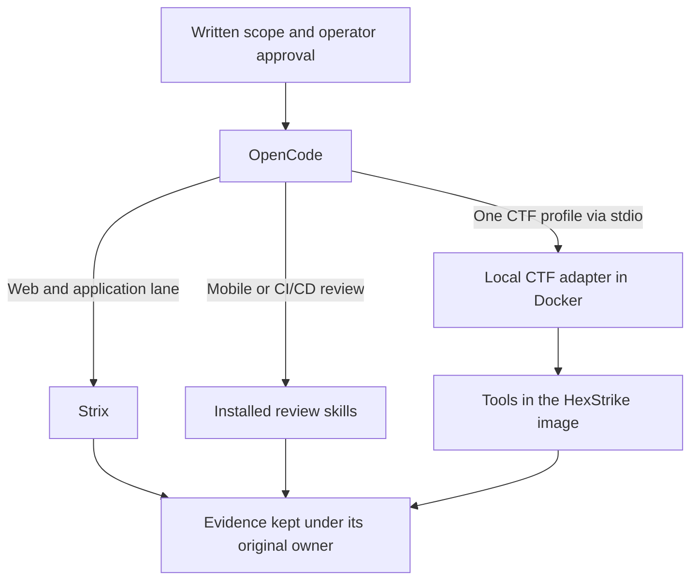

# Hacking Workshop

A local workspace for authorized security assessments and capture-the-flag
(CTF) practice. It connects OpenCode, Strix, category skills, and a Docker
toolchain through explicit scope and evidence rules.

**Status: experimental.** Local checks cover the adapter, configuration, and
synthetic fixtures. They do not establish that every installed tool works on
both CPU architectures or that a live assessment is safe to run.

The CTF configuration uses the name **OmniCTF**. That name also appears in the
tool manifests, fixtures, and generated coverage matrix.

## Start here

| Task | Guide |
| --- | --- |
| Set up the workspace and run one authorized lane | [Getting started](./docs/getting-started.md) |
| Understand ownership and operating modes | [Operating modes](./docs/opencode-operating-modes.md) |
| Inspect the declared tools and fixture coverage | [Coverage matrix](./docs/coverage-matrix.md) |
| Change code, tools, or skills | [Contributing](./CONTRIBUTING.md) |
| Prepare a GitHub source release | [Publishing](./docs/publishing.md) |
| Report a security issue | [Security policy](./SECURITY.md) |

To check a checkout without starting an assessment:

```sh
./scripts/validate-release.sh
```

This needs Git, Python 3.10 or later, a C compiler, and Docker Compose 2.24.4 or
later. It does not build or start the tool container. Gitleaks is optional for
local development and required by the publication check:

```sh
./scripts/validate-release.sh --require-secrets
```

## How it works

Mode 1 is the default. OpenCode selects one lane and records its evidence.
Each lane has one owner:



- **Strix** owns Web, API, application source, LLM application, AWS, Kubernetes,
  and Active Directory assessments, including its validation and report.
- **Mobile and CI/CD skills** guide separate source or artifact review lanes.
- **The local CTF adapter** exposes named tool operations for one selected
  profile. It checks request paths, scope, options, and resource limits, then
  writes structured results and complete process output.
- **OpenCode** owns routing and the cross-lane evidence index. It preserves the
  source and validation state of each result.

The adapter runs beside the pinned upstream HexStrike HTTP server. CTF MCP
calls use the adapter directly through `docker compose exec`; they do not pass
through that HTTP server. See the [interface decision](./docs/adr/0001-ctf-tool-interface.md).

## Tool profiles

Every MCP entry starts disabled in [opencode.json](./opencode.json). Enable
only the profile for the selected lane. The catalog exposes inventory only.

| Profile | Examples from the declared toolchain |
| --- | --- |
| Reverse | Ghidra, radare2, capa, angr, JADX, ILSpy, WABT |
| PWN | pwndbg, pwntools, checksec, ROPgadget, Ropper, QEMU |
| Forensics | Volatility 3, tshark, Sleuth Kit, carving and media tools |
| Crypto | SageMath, RsaCtfTool, fpylll, Z3, Hashcat, John |
| OSINT | DNS/WHOIS, archive, username, and media tools |
| Blockchain | Foundry, Slither, Echidna, Mythril, Agave, Anchor |
| Misc | Data, media, language, and scientific Python tools |
| KOTH | Service snapshot, patch, rollback, and flag submission operations |
| Web gap | A recorded gap in Strix coverage only |

The [coverage manifest](./config/coverage.json) maps capabilities to owners,
skills, profiles, and fixtures. A listed tool is a declared integration; use
runtime evidence to establish whether it works for a particular task.

## Safety and data boundaries

Use this project only with written authorization for the exact targets,
accounts, actions, and time window. Read [AGENTS.md](./AGENTS.md) before an
assessment. The example scope is inactive and grants no network or KOTH access.

The container has a read-only root filesystem, read-only input, and writable
output. It has no Docker socket, host home directory, or credential mounts.
The default bridge network permits outbound traffic; the optional offline
configuration uses an internal network and publishes no host port.

These controls are not a complete sandbox for hostile code. Scope checks apply
to adapter requests; they do not act as a network firewall for child processes
or for the separate upstream HTTP API. KOTH digests bind and consume an exact
action, but human approval must still come from the operator through the
client permission prompt. See [enforcement and limits](./docs/opencode-operating-modes.md#enforcement-and-limits).

Private engagements, artifacts, logs, and evidence belong in ignored paths.
Only the sanitized `engagements/example` template belongs in Git.

## Repository map

| Path | Purpose |
| --- | --- |
| `.opencode/skills/` | Project skills and selected upstream skill files |
| `config/` | Toolchain and skill provenance; coverage source |
| `container/hexstrike/` | Image build, tool registry, profiles, and Python adapter |
| `contracts/` | Scope, coverage, and tool-result JSON schemas |
| `fixtures/`, `tests/` | Synthetic challenges and adapter contract tests |
| `scripts/` | Local validation and coverage generation |
| `engagements/example/` | Sanitized scope, instructions, and evidence index templates |
| `workbench/input/`, `workbench/output/` | Ignored runtime input and evidence |

## Build and verification limits

The full native image needs substantial disk space; plan for at least 40 GiB.
The CI workflow is configured to build AMD64 and ARM64 images, record package
versions, generate SPDX inventories, and upload vulnerability reports. It does
not publish images. The vulnerability report is informational, not a release
gate.

Source revisions and selected download checksums are pinned. Kali packages
and some transitive dependencies resolve at build time, so builds are not
byte-for-byte reproducible. GPU cracking, Windows-only tools, physical device
forensics, and blockchain platforms beyond EVM and Solana are outside the
declared scope.

Project-authored code is [Apache-2.0](./LICENSE). Bundled skills and downloaded
tools retain their own licenses. Read [third-party notices](./THIRD_PARTY_NOTICES.md)
and the [publication checks](./docs/publishing.md) before redistribution.
