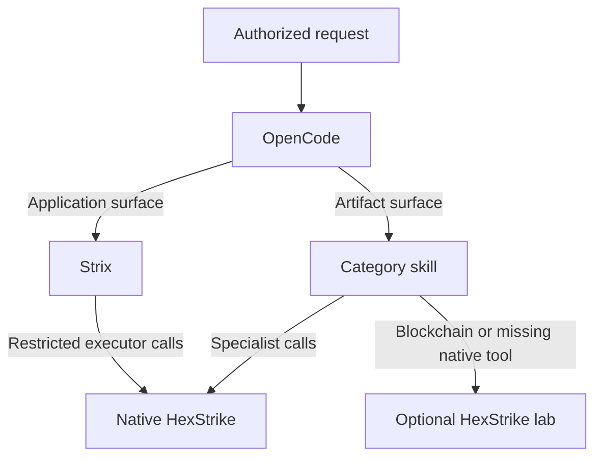

# Routing model

OpenCode is the router. It reads the request, loads `ctf-router`, and selects
one planner for each surface.

## Ownership

Strix owns web, API, application source, LLM application, AWS, Kubernetes,
Active Directory, and dependency assessments. It writes the assessment result.
OpenCode does not run a second HexStrike lane against a Strix-owned surface.

OpenCode owns artifact routing. It uses the category skills for reverse
engineering, PWN, forensics, crypto, OSINT, blockchain, malware, AI or ML,
and miscellaneous files. HexStrike performs individual operations; it is not a
planner or report owner.

For a mixed request, OpenCode defines independent surfaces before work starts.
For example, an application URL goes to Strix while an attached executable goes
to `ctf-reverse` and HexStrike.

## Backends

Native HexStrike runs from `.hexstrike/native/hexstrike-ai` and listens on
`127.0.0.1:8888`. OpenCode and Strix each start an MCP bridge to that same
local service. The Strix bridge has a small allowlist for its application lane.

The optional Docker lab is for tools that native HexStrike does not expose,
especially blockchain tools. Start it only after `./scripts/setup --lab`.
It exposes a single `lab` profile without competition mutation operations.

## Safety boundary

Written authorization defines scope. Local tool permissions and Docker
isolation reduce accidental use; they do not validate authorization, target
identity, or impact. Keep credentials and evidence outside Git. Stop work when
scope or impact is uncertain.
